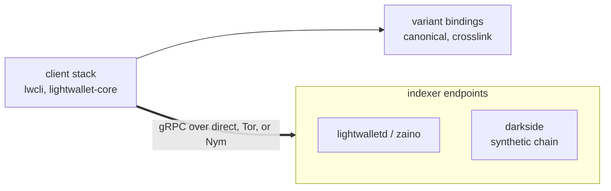

# Zcash Lightwallet Protocol Layer

Rust tooling for lightwalletd-style Zcash indexers, on both sides of the
wire. The client crates put two protocol variants behind one generic API,
CANONICAL ([`zcash/lightwallet-protocol`](https://github.com/zcash/lightwallet-protocol))
and CROSSLINK (the Crosslink fork's additive mirror), and route them
directly or through Tor or Nym without changing call sites. The darkside
crates serve that same wire surface from a deterministic synthetic chain.
A wallet pointed at one syncs against a fabricated history exactly as it
would against a real indexer.

> **Status: heavily experimental, heavy LLM-authored code right now.** Treat
> most of this repo as a moving target that can change or break without notice.
> The only stable-ish crates are the three library ones you would depend on:
> [`lightwallet-core`](crates/core),
> [`lightwallet-proto-canonical`](crates/canonical), and
> [`lightwallet-proto-crosslink`](crates/crosslink). Everything else (the
> transports, CLI, and the darkside tooling) is in flux.



## Crates

- [`lightwallet-proto-canonical`](crates/canonical): generated tonic/prost bindings for the canonical lightwalletd protocol.
- [`lightwallet-proto-crosslink`](crates/crosslink): the same generated bindings, for the Crosslink variant.
- [`lightwallet-core`](crates/core): the client layer proper, typed access to indexers that is generic over both variant and transport. Its README covers taking it as a dependency.
- [`lightwallet-transport-tor`](crates/transport-tor): tonic channels over Tor via arti, each channel its own circuit-isolation domain.
- [`lightwallet-transport-nym`](crates/transport-nym): tonic channels through the Nym mixnet via a running `nym-socks5-client` (experimental).
- [`lightwallet-cli`](crates/cli): `lwcli`, a one-shot point-at-anything debug client covering the full RPC surface.
- [`lightwallet-test-support`](crates/test-support): in-memory mock endpoints with fault injection, plus a SOCKS5 test server.
- [`darkside-chain`](crates/darkside-chain): a deterministic Zcash chain state machine with no network, clock, or I/O.
- [`darkside-decl`](crates/darkside-decl): parses authored `.decl` files into chains and scenarios.
- [`darkside-serve`](crates/darkside-serve): serves both variants' streamer surfaces over one darkside chain, plus the HTTP control surface and the live and scenario drivers.
- [`darkside`](crates/darkside): the `darkside` binary, a live network-flavored synthetic chain served over TCP.
- [`darkside-repl`](crates/darkside-repl): an interactive console that drives a running darkside (mine, fund, reorg, retime) over its control surface.

## Development

`just` lists the recipes. The main ones:

```
just check       # protos compile, mirror is additive, workspace + feature matrix build
just test        # offline suite: unit tests + the in-memory mock harness
just live-check  # conformance against real endpoints (nightly, not per-commit)
just coverage    # llvm-cov over the offline suite
```

The mock suite proves self-consistency (both ends share the generated
types). The live suite is the conformance check. Implementation status and
the load-bearing decisions live in [high-level.md](high-level.md).
