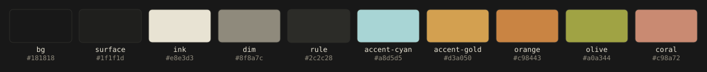
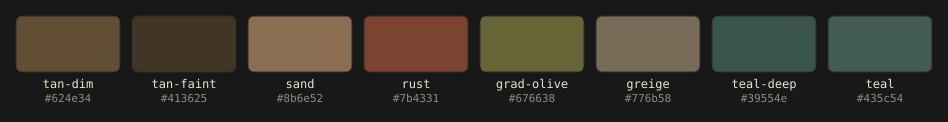

# lwtui design notes

## Color tokens

Chrome (foreground/UI). Never ANSI 0-15.



| token       | rgb     | role                           |
|-------------|---------|--------------------------------|
| bg          | #181818 | app ground, painted every cell |
| surface     | #1f1f1d | content panes, flat            |
| ink         | #e8e3d3 | body text                      |
| dim         | #8f8a7c | labels, secondary              |
| rule        | #2c2c28 | borders                        |
| accent-cyan | #a8d5d5 | tags, section markers          |
| accent-gold | #d3a050 | values, active, focus          |
| orange      | #c98443 | live readouts                  |
| olive       | #a0a344 | code, literals                 |
| coral       | #c98a72 | warnings                       |

Gradient body, dither fields only. These values are the source hues already
dimmed 40% toward `bg`; the dim factor is the single brightness knob, held at
its default and applied at the palette level, not at runtime.



| token      | rgb     |
|------------|---------|
| tan-dim    | #624e34 |
| tan-faint  | #413625 |
| sand       | #8b6e52 |
| rust       | #7b4331 |
| grad-olive | #676638 |
| greige     | #776b58 |
| teal-deep  | #39554e |
| teal       | #435c54 |

## Dither gradient (`--experimental-dither[-braille]`)

An idle animation in the empty tail of the focused pane — the tx list (mempool)
or the tx view (an open drill), never any other pane. The band fills from just
below the pane's last content line down through the footer, and the field fades
toward its top edge (full strength at the bottom row, `OPACITY·y`), so it
anchors to the screen bottom and dissolves up toward the content — visibly
reaching about halfway. It fills only blank cells, so it never covers a row, and
its background is the app ground, so it blends into the pane rather than reading
as a loading screen.

`src/dither.rs` renders it, `App` owns the clock, `ui::gradient_band` places it
over the focused pane computed by `ui::focused_pane`.

### Value field

Coords normalized `0..1` over the pane, `t` the field clock in seconds. Three
blobs orbit on independent cosine/sine paths:

```
b1 = (0.50 + 0.30 cos(0.40 t),        0.42 + 0.26 sin(0.31 t))         w = 1.00
b2 = (0.50 + 0.34 cos(2.1 - 0.23 t),  0.55 + 0.30 sin(0.19 t + 1.0))   w = 0.85
b3 = (0.50 + 0.26 cos(0.17 t + 4.2),  0.50 + 0.34 sin(3.3 - 0.27 t))   w = 0.70

falloff(d²) = 1 / (1 + 4.5 d²)²        // rational stand-in for exp(-9 d²)
v  = Σ wᵢ · falloff(|p - bᵢ|²)
v *= 0.72 + 0.28 sin(6x - 4y + 1.3 t)  // diagonal wave
v  = clamp(v - 0.06, 0, 1)
```

Blob centers computed once per frame, never per cell. Field sampled once per
cell. No allocation in the render path.

### Color

Value drives glyph density, blob position drives hue. Per cell the hue is the
blob colors (`sand`←b1, `rust`←b2, `grad-olive`←b3) weighted by the cubed
falloffs, over a `tan-faint` floor where every blob is far, then washed
`greige` at the top and `teal-deep` at the bottom. Cubing sharpens toward the
nearest blob so the hues stay saturated instead of averaging to one brown,
while still blending smoothly across overlaps. A cell near b2 reads rust, its
shade coverage says how bright.

### Dither

Bayer 8×8, threshold `(M[y%8][x%8] + 0.5) / 64`. Every cell's `bg` is the app
ground, so the field blends into the pane; the `fg` hue is faded toward the
ground by an opacity of `0.45`, so it reads as a faint material. Two charsets:

- **Braille** (`--experimental-dither-braille`, the preferred look). 2×4 dots
  per cell, each on when its subpixel value clears the Bayer threshold, for a
  finer field. Takes precedence when both flags are passed. Font support is a
  gamble (dots misalign or tofu on some terminals), so it stays opt-in.
- **Blocks** (`--experimental-dither`). Ramp `[' ','░','▒','▓','█']`, glyph =
  `SHADES[floor(v·4 + bayer)]`. Near-universal and cell-aligned, the fallback
  where braille glyphs don't render.

### Motion

`t` advances 0.5 units per second of active animation, quantized to a 90ms
step so the frame rate caps near 11fps and frozen frames diff to nothing. The
loop never repeats, it drifts.

Pauses (freezes on the last frame) on input focus (`/` search, `?` help, which
take over the footer) and on manual pause. It never idles out, so it keeps
drifting whether or not the user is typing. An open tx does not pause it; the
strip lives in the footer, not the tx pane.

### Degrade

Needs truecolor (`COLORTERM = truecolor` or `24bit`). Flag off, `NO_COLOR`, or
a 256-only terminal: flat `surface`, no gradient.
