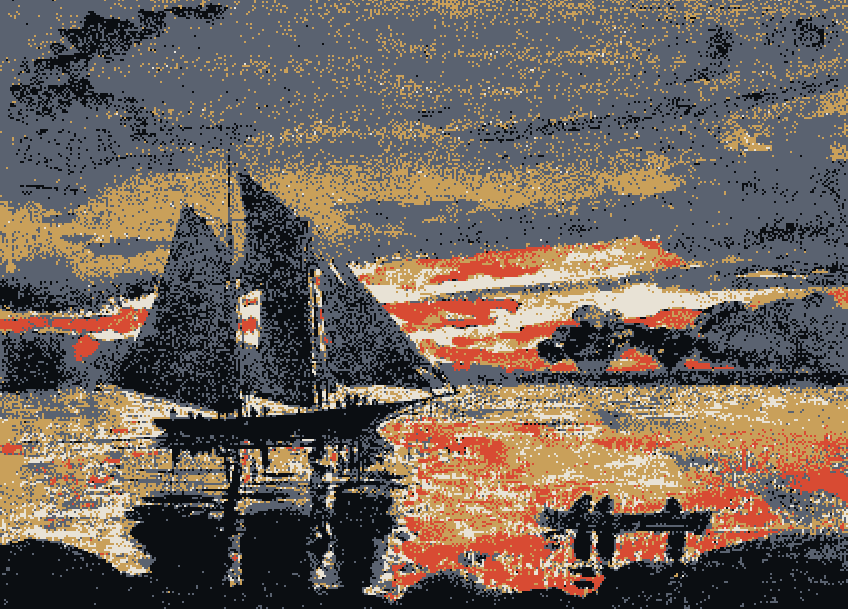

# lightwallet-tui (`lwtui`)



A live terminal block explorer and mempool monitor for Zcash lightwallet indexers.

## Usage

```
lwtui --url https://zec.rocks:443
```

Watch the mempool fill and clear each block, browse the recent block tail, drill
into any transaction, and look up a height, txid, or transparent address.
`--output ndjson` swaps the UI for a machine-readable feed on stdout.

## Crosslink support

`lwtui` also works with Crosslink! Point it at a Crosslink indexer with `--variant crosslink`, and pass the
featurenet's own block spacing to keep the health heuristic accurate:

```
lwtui --url http://127.0.0.1:9067 --variant crosslink --target-spacing 15
```

## Visual modes

An animated dither gradient can back the idle tail of the focused pane. Prefer
`--experimental-dither-braille` (finer 2×4 braille dots). Fall back to
`--experimental-dither` (universal shade blocks) where braille glyphs don't
render. The braille flag wins when both are passed. Both need a truecolor
terminal (`COLORTERM=truecolor`) and degrade to a flat pane under `NO_COLOR`.
[DESIGN.md](DESIGN.md) covers the field math and color tokens.

## Keys

| key           | action                                        |
|---------------|-----------------------------------------------|
| `Tab`         | switch mempool ⇄ blocks                       |
| `j` `k` `↑` `↓` | move selection (scroll a focused drill-down) |
| `Enter` `→`   | open detail: a block, then a tx, or a mempool tx |
| `Esc` `←`     | step back, or close the detail / results view |
| `n` `N`       | walk txs: a block's list or t-address results |
| `r`           | drill-down: raw ⇄ human                        |
| `y` `Y`       | copy tx JSON / raw hex to clipboard           |
| `/`           | search: height, txid, or t-address            |
| `Space`       | pause live-follow                             |
| `?`           | toggle the help modal                         |
| `q` `Ctrl-C`  | quit                                          |
